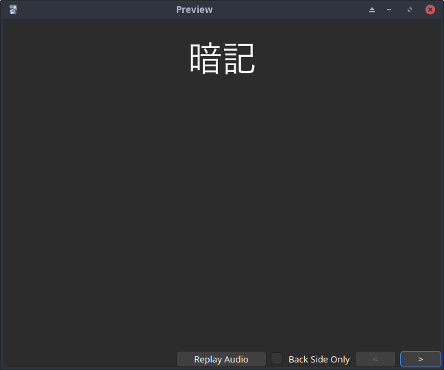
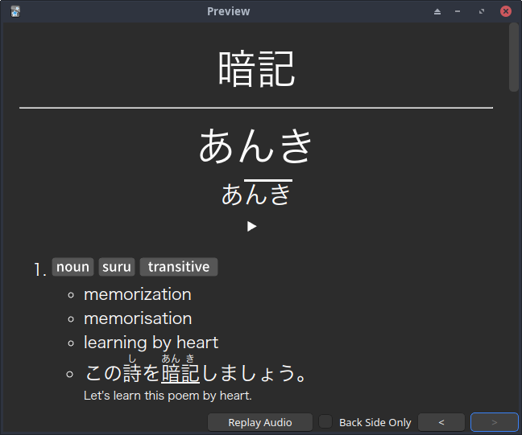

# Crop Theft

A simple and robust Anki note type.

## Crop Theft Vocab

Front                                                      |  Back
:--------------------------------------------------------: |:---------------------------------------------------------:
  |  

### Quick Install

- Download [Crop Theft Vocab Anki Deck](https://raw.githubusercontent.com/Kuuuube/crop-theft/main/crop_theft_vocab/Crop%20Theft%20Vocab.apkg).

- Load the deck into Anki.

- You will now have the Crop Theft Vocab note type. You can either use the `Crop Theft Vocab` deck directly or delete it and use the note type in your own deck.

- Check [Guides](README.md#guides) if you aren't sure where to go from here.

### Note Template

| [Front Template](./crop_theft_vocab/front_template.html) | [Back Template](./crop_theft_vocab/back_template.html) | [Styling](./crop_theft_vocab/styling.css) |
|----------------------------------------------------------|--------------------------------------------------------|-------------------------------------------|

### Field Setup

| Field            | Yomitan                   | Jidoujisho   |
|------------------|---------------------------|--------------|
| Word             | {expression}              | Term         |
| Reading          | {reading}                 | Reading      |
| PitchPattern     | {pitch-accents}           | Pitch Accent |
| Audio            | {audio}                   | Term Audio   |
| Definition       | {glossary-brief}          | Meaning      |
| Example Sentence | {sentence}                | Sentence     |
| Example Target   | {search-query}            | Cloze Inside |
| Frequency        | {frequency-harmonic-rank} | Frequency    |
| Notes            |                           | Empty        |

### Guides

[Yomitan Setup](./crop_theft_vocab/guides/yomitan_setup.md)

[Jidoujisho Setup](./crop_theft_vocab/guides/jidoujisho_setup.md)

[Frequency Sorting in Anki](./crop_theft_vocab/guides/frequency_sorting_anki.md)

### Modifications (Optional)

[Compact Gloss](./crop_theft_vocab/modifications/compact_gloss/README.md)
